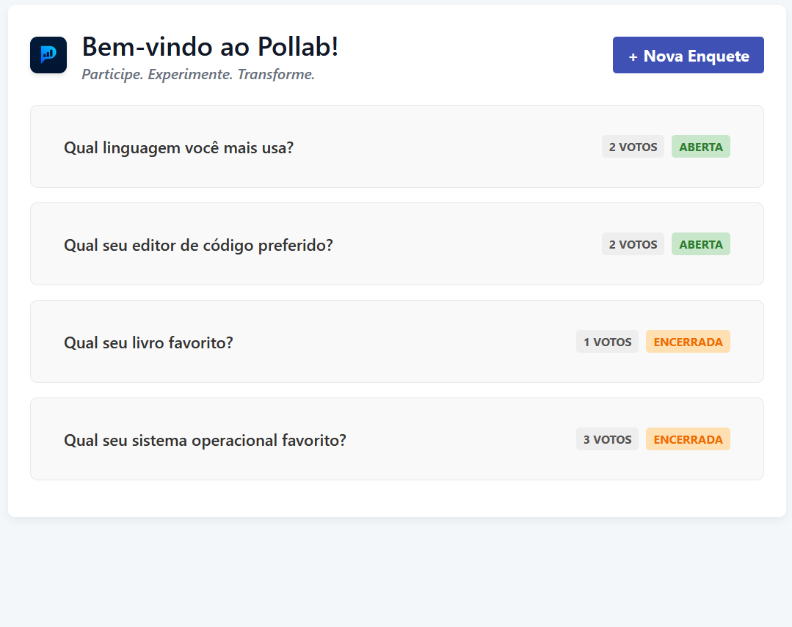
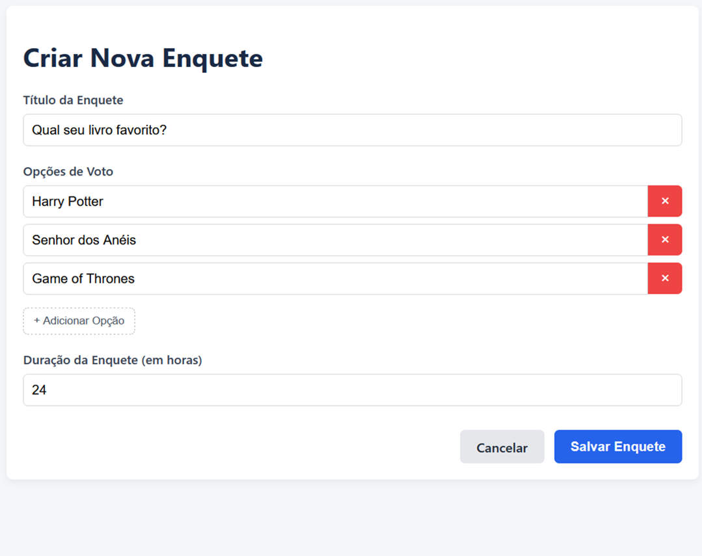
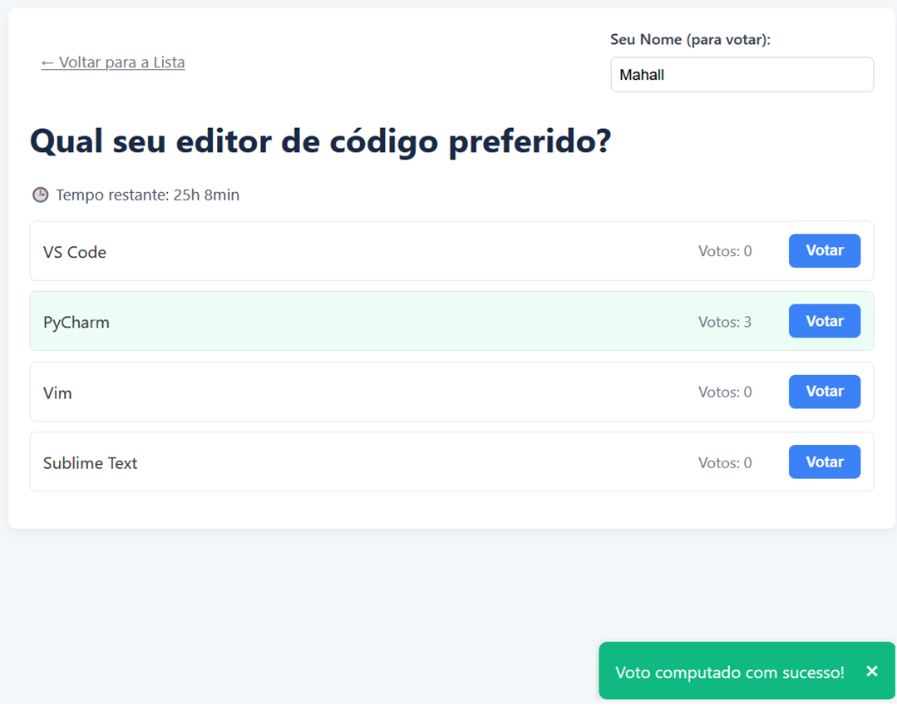
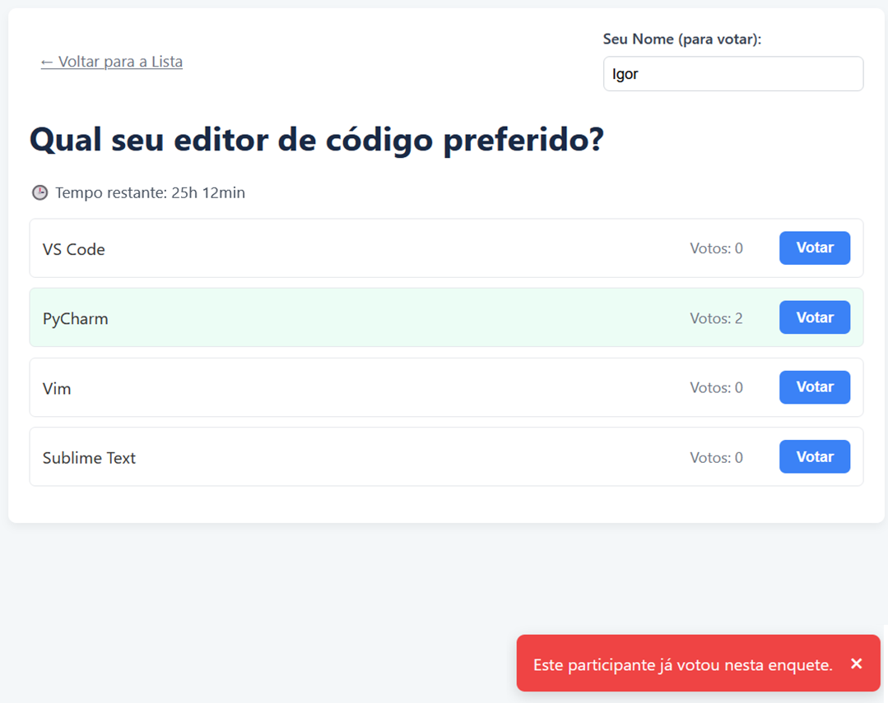
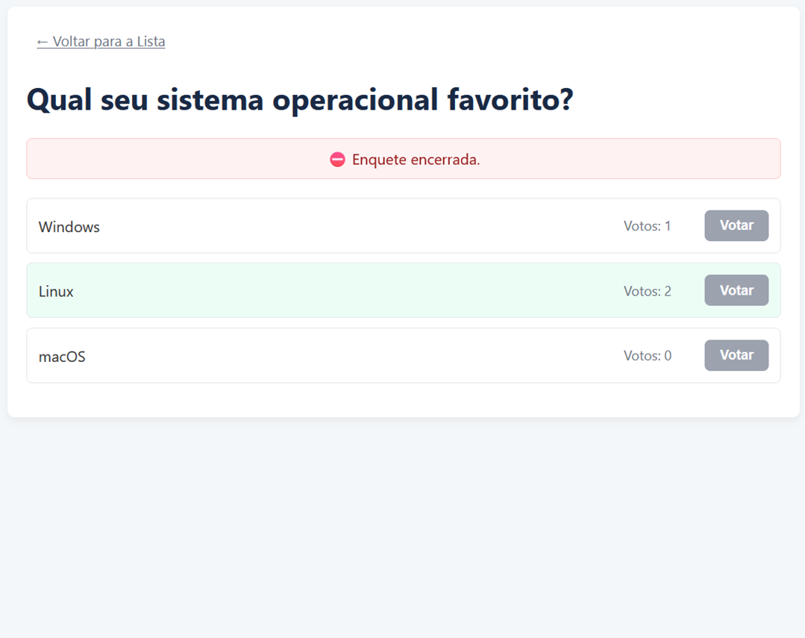

# 🧪 Pollab — The Opinion Lab (Frontend)

Pollab is a modern, minimalist polling platform for real-time participation and feedback. With a clean UI and dynamic voting experience, users can create, share, and vote on surveys effortlessly.

Built with **Angular 17** (using Standalone Components and Reactive Forms) and powered by a **Django REST API**, Pollab is ideal for feedback collection, decision-making, and interactive demonstrations.

> **Join. Experiment. Transform.**

## Interface

<p align="center">
  
  
  
  
  
</p>

---

## ✨ Overview

| Item             | Details                                            |
|------------------|----------------------------------------------------|
| **Stack**        | Angular 17 · TypeScript · RxJS · Vite · Tailwind   |
| **Architecture** | Standalone Components + Services + feature folders |
| **API**          | Django REST Framework (`/api/enquetes/…`)          |
| **State**        | `EnqueteService` + Observables (RxJS)              |
| **Build**        | `ng build`                                         |
| **Deploy**       | Netlify                                            |

---

## 📂 Folder Structure (`src/app`)

```
src/app
├─ models/        # TypeScript Interfaces (Poll, Option)
├─ services/      # API access and notification logic
├─ components/    # UI components for each feature/view
└─ app.routes.ts  # Root routes of the application
```

## ⚙️ Setup

1. **Clone & Install**
   ```bash
   git clone https://github.com/igormahall/pollab-frontend.git
   cd pollab-frontend
   npm install
   ```

2. **Backend Configuration**
   - Requires the **Django API** (`poll-api`) running locally.
   - Edit `src/environments/environment.ts` and ensure `apiUrl` points to your local backend (e.g. `http://127.0.0.1:8000/api`).
   

3. **Run the App**  
   ```bash
   ng serve
   ```

---

## 🎯 Features

1. **Dinamic Voting**

- Each poll displays its available options and the number of votes per option.
- Visual highlight for the most voted option.
- Voting buttons with state control (e.g., disabled when voting or after poll closure).

2. **Creation Form**

- Reactive form with validation rules:
  - Title must have at least 5 characters.
  - Minimum of 2 and maximum of 10 options.
  - Custom poll duration (in hours).
- Options can be dynamically added or removed.
- Visual feedback and clear error messages.

3. **Notifications**

- Success and error messages via  `NotificationService` and `NotificationComponent`.
- Displayed as non-intrusive toast alerts for better UX.

4. **Countdown Timer**

- Displays the remaining time for each poll.
- Visual alert when less than 5 minutes are left.

### Data Handling (`services/`)

API interaction is centralized in `EnqueteService` for clean separation and reuse.

| Method              | Endpoint                          | Description                                                |
|---------------------|-----------------------------------|------------------------------------------------------------|
| `getEnquetes()`     | `GET /api/enquetes/`              | Lists all polls (open and closed).                         |
| `getEnqueteById()`  | `GET /api/enquetes/{id}/`         | Fetches poll details.                                      |
| `createEnquete()`   | `POST /api/enquetes/`             | Creates a poll with `title`, `options_input[]`, and `duration`. |
| `votar(...)`        | `POST /api/enquetes/{id}/votar/`  | Casts a vote for a given `participant_id`.                 |

---

## 🧩 Components & Routing

The UI is composed of focused components mapped by `app.routes.ts`.

| Route             | Component                 | Purpose                                                                                       |
|-------------------|---------------------------|-----------------------------------------------------------------------------------------------|
| `/`               | `EnqueteListComponent`    | Displays poll list, vote counts, and creation shortcut.                                      |
| `/enquetes/:id`   | `EnqueteDetailComponent`  | Shows poll details, enables voting, and shows result highlight.                              |
| `/enquetes/nova`  | `EnqueteFormComponent`    | Reactive form to create polls, with dynamic option management.                               |
| _(global)_        | `NotificationComponent`   | Global toast notifications for feedback.                                                     |
| _(shell)_         | `AppComponent`            | Root container with `<router-outlet>`.                                                       |
---

## 💎 UX Highlights

- **Smart Toasts**: `NotificationService` provides real-time feedback for actions like voting and creation.
- **Single Vote Safety**: Buttons are disabled during submission with loading labels.
- **Highlight Leader**: Top-voted option gets visual emphasis.
- **Poll Status**: Banners clearly mark closed polls and disable interaction.
- **Simulated Users**: A name field simulates multi-user voting for testing.
- **Minimal Navigation**: Back button returns cleanly to poll list without history issues.

---

## 🚀 Deployment

1. **Backend**: Deploy Django API (Render, Heroku, etc.)
2. **Frontend**:
  - Update the production URL in `src/environments/environment.prod.ts`.
  - Build:
    ```bash
    ng build
    ```
  - Upload the contents of `dist/pollab-frontend` to a static host (e.g. Netlify, Vercel).

3. **CORS**: Remember to include your frontend URL in Django's `CORS_ALLOWED_ORIGINS`.

---

## 🤝 Contributing

Open to contributions! Suggest features, improvements or fixes via issues or PRs.

---

## 📝 License

Distributed under the **MIT** license.
